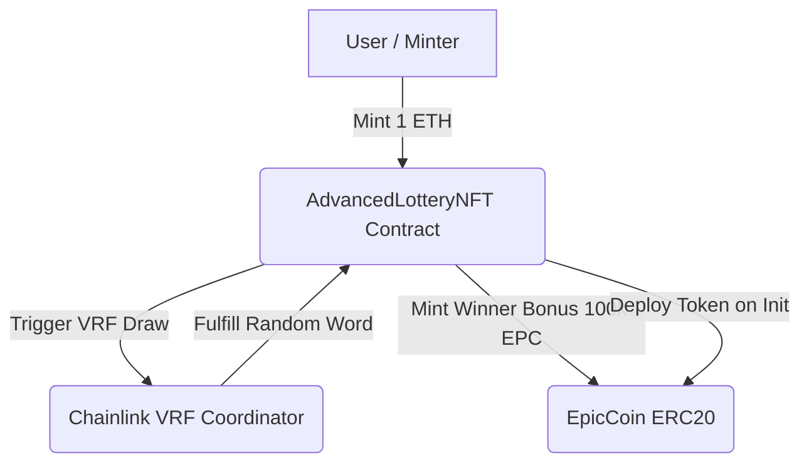

# 🎰 Epic Pool Lottery NFT & Epic Coin (`EPC`)

An end-to-end Web3 ecosystem combining a **Strict 10-NFT Collection**, on-chain metadata generation, **Chainlink VRF v2.5** verifiably random drawings, and an integrated **500 Million ERC20 Tokenomics** model with automated winner payout rewards.

---

## 📌 Project Overview

The **Epic Pool Lottery** project connects an NFT collection with a custom ERC20 utility token (`EPC`). When all 10 tickets are sold or 10 secondary marketplace transactions occur, Chainlink VRF automatically selects a fair winner and distributes ETH prizes alongside **100,000 EPC** bonus rewards.

---

## 📊 Tokenomics Breakdown (`EPC`)

* **Token Name:** Epic Coin  
* **Ticker:** `EPC`  
* **Decimals:** `18`  
* **Max Hard Cap:** `500,000,000 EPC` (Strictly enforced on-chain)

| Allocation Category | Percentage | Amount (`EPC`) | Purpose / Wallet Destination |
| :--- | :--- | :--- | :--- |
| **Liquidity Pool & Owner** | **70%** | `350,000,000` | Minted to owner for DEX Liquidity (Uniswap) + Treasury |
| **Team & Salaries** | **10%** | `50,000,000` | Minted directly to designated Team Wallet |
| **Winner Reward Reserve** | **20%** | `100,000,000` | Unminted reserve capacity inside contract (1,000 payouts of 100k EPC) |

---

## ⚙️ Core Features & Mechanics

### 🎨 Primary Minting
* **Fixed NFT Cap:** Exactly 10 NFTs total (`EPIC NUMBER #1` to `EPIC NUMBER #10`).
* **Mint Price:** `1.0 ETH` flat per ticket.
* **Metadata:** 100% generated on-chain using Base64 encoding. No IPFS or centralized server dependencies.
* **Primary Draw:** Triggered automatically when the 10th ticket is minted.
  * **Winner (1 minter):** Receives **5.0 ETH** + **100,000 EPC**.
  * **Owner:** Receives **5.0 ETH**.

### 🏪 Secondary Marketplace & Raffle
* **Internal Listing:** Token owners can list their NFTs directly on-chain.
* **Dynamic Fee Structure:**
  * Sales $> 1.0\text{ ETH}$: 10% fee.
  * Sales $\le 1.0\text{ ETH}$: 0.1 ETH flat fee.
* **Secondary Draw:** Triggered automatically after every 10 marketplace transactions.
  * **Winner (1 buyer):** Receives **75%** of accumulated marketplace fees + **100,000 EPC**.
  * **Owner:** Receives **25%** of accumulated marketplace fees.

---

## 🛠️ Smart Contract Architecture



---

## 🚀 Local Setup & Installation

### Prerequisites
* [Node.js v18+](https://nodejs.org/)
* [MetaMask Wallet](https://metamask.io/)
* [Chainlink VRF v2.5 Subscription ID](https://vrf.chain.link/)

### Installation

1. **Clone the Repository:**
   ```bash
   git clone [https://github.com/YOUR_USERNAME/epic-pool-lottery.git](https://github.com/YOUR_USERNAME/epic-pool-lottery.git)
   cd epic-pool-lottery
   ```

2. **Install Dependencies:**
   ```bash
   npm install @openzeppelin/contracts @chainlink/contracts
   ```

3. **Configure Environment:**
   Copy `.env.example` to `.env` and fill in your private parameters:
   ```bash
   cp .env.example .env
   ```

---

## 📜 Deployment Guide

### Option A: Via Remix IDE
1. Open [Remix IDE](https://remix.ethereum.org).
2. Create `AdvancedLotteryNFT.sol` and paste the full contract code.
3. Select Compiler version `0.8.20` or higher.
4. Set Environment to **Injected Provider - MetaMask**.
5. Pass the 4 Constructor arguments:
   * `subscriptionId`: Your Chainlink Subscription ID.
   * `keyHash`: VRF Gas Lane Key Hash for your chosen network.
   * `vrfCoordinator`: Chainlink Coordinator Address (e.g., `0x9DdfaCa8183c41ad55329BdeeD9F6A8d53168B1B` for Sepolia).
   * `teamWallet`: Wallet address to receive the 50M EPC team allocation.
6. Click **Transact**.

---

## 🛡️ Security & Access Controls

* **Immutable Supply Cap:** `MAX_SUPPLY` hardcoded to $500,000,000 \cdot 10^{18}$ wei units.
* **Mint Restrictions:** `EpicCoin.mint()` can only be called by the parent `AdvancedLotteryNFT` contract.
* **Tamper-Proof Randomness:** Powered by Chainlink VRF v2.5 using cryptographic proof.

---

## 📄 License

Distributed under the **MIT License**. See `LICENSE` for details.
